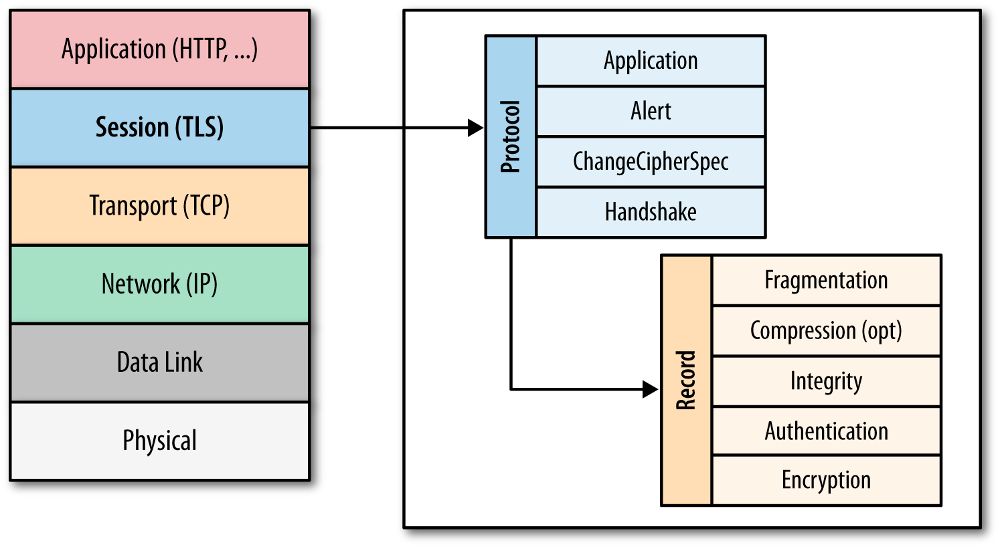
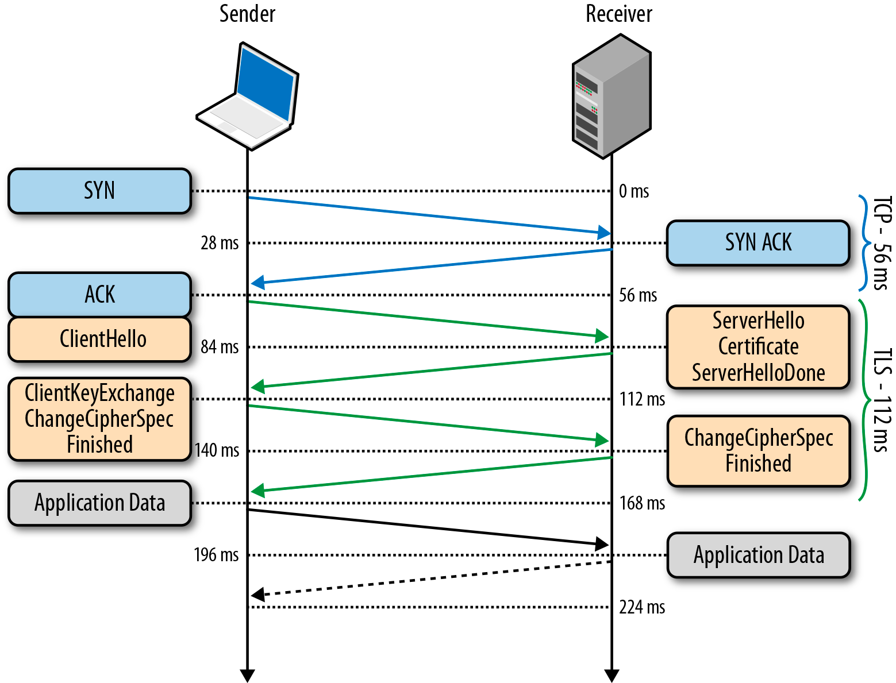

### [TLS](https://habr.com/ru/post/258285/)

#### TLS Handshake

Перед тем, как начать обмен данными через TLS,
клиент и сервер должны согласовать параметры соединения,
а именно: версия используемого протокола, способ шифрования данных,
а также проверить сертификаты, если это необходимо.
Схема начала соединения называется TLS Handshake:
