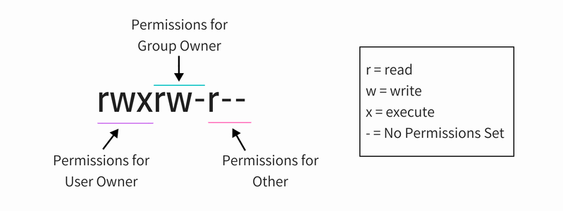

### Права на файлы


### Пакетный менеджер
[список комманд](https://www.kobzarev.com/linux/apt-get-and-apt-cache/)

Просмотр инфо о пакете	
>apt-cache show netcat

Обновление списка пакетов в системе
>sudo apt-get update

Обновление самих пакетов
>sudo apt-get upgrade

Обновление вне зависимости от требований самих пакетов	
>sudo apt-get dist-upgrade

### Дескрипторы и inode

file descriptor

```ls -lah /proc/15771/fd/```
