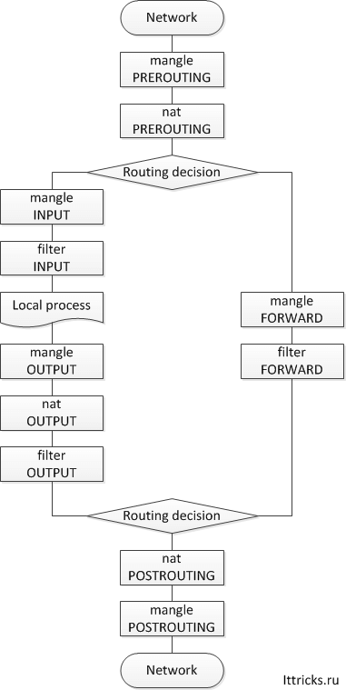

### iptables
[manual](https://www.opennet.ru/docs/RUS/iptables/)  
[kak-zablokirovat-ip-v-iptables](https://losst.ru/kak-zablokirovat-ip-v-iptables)
```
Все сетевые пакеты, которые проходят через компьютер,
отправляются компьютером или предназначены компьютеру,
ядро направляет через фильтр iptables. 
Там эти пакеты поддаются проверкам и затем для каждой проверки,
если она пройдена выполняется указанное в ней действие.
Например, пакет передается дальше ядру для отправки целевой программе,
или отбрасывается.
```
- **Input** - обрабатывает входящие пакеты и подключения. Например, если какой-либо внешний пользователь пытается подключиться к вашему компьютеру по ssh или любой веб-сайт отправит вам свой контент по запросу браузера. Все эти пакеты попадут в эту цепочку;
- **forward** - эта цепочка применяется для проходящих соединений. Сюда попадают пакеты, которые отправлены на ваш
  компьютер, но не предназначены ему, они просто пересылаются по сети к своей цели. Как я уже говорил, такое наблюдается
  на маршрутизаторах или, например, если ваш компьютер раздает wifi;
- **output** - эта цепочка используется для исходящих пакетов и соединений. Сюда попадают пакеты, которые были созданы при попытке выполнить ping losst.ru или когда вы запускаете браузер и пытаетесь открыть любой сайт.
___
- ***prerouting*** - в эту цепочку пакет попадает перед обработкой iptables, система еще не знает куда он будет отправлен, в input, output или forward;
- ***postrouting*** - сюда попадают все проходящие пакеты, которые уже прошли цепочку forward.

Правила образуют цепочку, поэтому input, output и forward называют цепочками, цепочками правил. Действий может быть несколько:

- ACCEPT - разрешить прохождение пакета дальше по цепочке правил;
- DROP - удалить пакет;
- REJECT - отклонить пакет, отправителю будет отправлено сообщение, что пакет был отклонен;
- LOG - сделать запись о пакете в лог файл;
- QUEUE - отправить пакет пользовательскому приложению.


Все правила `iptables -L` `iptables -nvL` `sudo iptables -t filter -L --line-number -n`
`sudo iptables -t filter -L INPUT --line-number -n`  
Добавить правило `sudo iptables -A INPUT -s 10.10.10.10 -j DROP`  
Добавить правило с лимитом соединений [hashlimit](https://ipset.netfilter.org/iptables-extensions.man.html#lbAW)  
`sudo iptables -A INPUT -s 192.168.1.199 -p tcp --dport 22345 -m hashlimit --connlimit-above 5/sec -j REJECT --reject-with tcp-reset`  
`-m connlimit`
`iptables -A INPUT -p tcp --syn --dport $port -m connlimit --connlimit-above N -j REJECT --reject-with tcp-reset`  
>iptables --reject-with type  
icmp-net-unreachable  
icmp-host-unreachable  
icmp-port-unreachable  
icmp-proto-unreachable  
icmp-net-prohibited  
icmp-host-prohibited or  
icmp-admin-prohibited  
tcp-reset  

###[Добавить правило с логом](https://habr.com/ru/post/259169/)
`sudo iptables -A INPUT -p ICMP --icmp-type 8 -s 192.168.1.0/24 -j LOG --log-prefix "ping detected: "`\
По умолчанию логи пишутся в `sudo tail -f /var/log/syslog`  
Удалить правило по номеру `sudo iptables -t filter -D INPUT 5`  
  
Cоздать файл `/etc/rsyslog.d/iptables.conf` со следующим содержанием:  
`echo ':msg, contains, "Iptables: " -/var/log/iptables.log' > /etc/rsyslog.d/iptables.conf`  
`echo '& ~' >> /etc/rsyslog.d/iptables.conf`  
  
Параметры:  
`& ~` — говорит о том, что дальнейшую обработку записи производить не следует, поэтому она не попадет в другие файлы логов.  
"Iptables: " — тот самый log-prefix — критерий по которому rsyslog принимает решение перенаправить лог в нужный файл. Префикс можно было и не менять, а оставить как есть — Ping detected, но если правило не одно, то удобнее иметь общий префикс для всех правил, который и был сделан.  
`/var/log/iptables.log` — сам файл лога.  
Перезапустить демон rsyslog:  
`/etc/init.d/rsyslog restart`  
